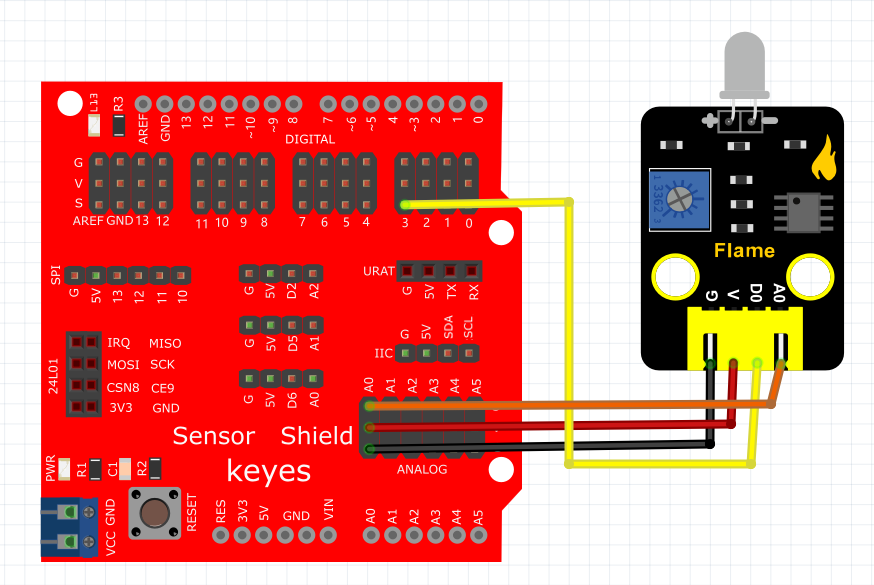
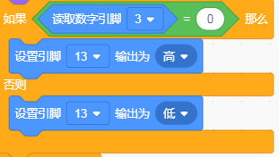
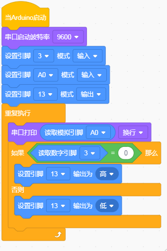

# KidsBlock

## 1. KidsBlock简介  

KidsBlock是一款以图形化编程为基础的教育平台，旨在直观地帮助孩子们学习编程和电子原理。通过拖放不同的编程模块，用户可以轻松创建功能多样的程序，而不需要深入了解复杂的编码细节。KidsBlock支持多种硬件平台，例如Arduino，使用户能够控制传感器、执行器和显示设备。其界面友好，提供丰富多样的编程模块和项目示例，让孩子们在动手制作的过程中，培养逻辑思维、创造能力和解决问题的能力，是STEAM教育的一个重要工具。  

## 2. 连接图  

  

## 3. 测试代码  

1. 在事件栏拖出Arduino启动模块，然后在串口栏拖出串口启动波特率模块并设置为9600。  

     

2. 在引脚栏拖出三个设置引脚模式模块，一个设置为引脚3输入，一个设置为引脚A0输入，另一个设置为引脚13输出。  

     

3. 在控制栏拖出重复执行模块。  

     

4. 在串口栏拖出打印模块，然后在引脚栏拖出读取模拟引脚模块，设置引脚为A0，放在打印模块的格子里。  

     

5. 在控制栏拖出判断模块，并在判断模块里添加运算的等于模块，等于模块的左边添加读取数字引脚3模块，右边为0；满足条件放第13引脚输出高电平，不满足条件第13脚输出低电平。  

     

     

## 4. 测试结果  

按照上图接好线，烧录好代码；上电后，打开串口监视器并设置波特率为9600可看到从火焰传感器读取到的模拟值。调节模块电位器，使模块上D1处于亮起和关闭的临界点，使D1关闭。传感器没有检测到火焰时，传感器上的D1灯关闭，板上的D13指示灯也关闭；当传感器检测到火焰时，传感器上的D1灯亮起，板上的D13指示灯亮起。

