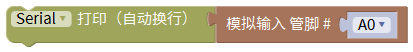

# Mixly

## 1. Mixly简介  

Mixly是一款图形化编程平台，致力于帮助初学者，尤其是儿童，通过可视化的方式学习编程。用户可以通过拖放不同的编程模块，避免传统编程中的语法错误，从而集中精力于逻辑和功能的实现。Mixly支持多种硬件平台，如Arduino，允许用户轻松控制各种传感器和执行器，并制作互动项目。该平台提供了丰富的编程模块和实例，可以帮助用户在实践中学习，从而提高他们的逻辑思维和创造能力，非常适合STEAM教育。  

## 2. 连接图  

  

## 3. 测试代码  

1. 在变量栏拖出声明变量模块，设置变量名为state_D为整数并赋值为0（数字0模块在数学栏里）。  

     

2. 在串口栏拖出串口打印（自动换行）模块，然后在输入/输出栏拖出模拟管脚模块并设置管脚为A0。  

     

3. 在变量栏拖出变量state_D赋值模块，然后在输入/输出栏拖出数字管脚模块，设置管脚为3。  

     

4. 在控制栏拖出判断模块，并在模块的设置里添加一个否则项。  

     

5. 在逻辑栏拖出等于模块放到如果后面，等于模块的第一个格子放变量state_D模块，第二个格子放数字0模块。  

     

6. 在输入/输出栏拖出数字引脚设置模块，设置管脚为13设为高电平放在判断模块的执行后面；复制一个数字引脚模块，设置管脚为13设为低电平放在判断模块的否则后面。  

     

## 4. 测试结果  

按照上图接好线，烧录好代码；上电后，打开串口监视器并设置波特率为9600可看到从火焰传感器读取到的模拟值。调节模块电位器，使模块上D1处于亮起和关闭的临界点，使D1关闭。传感器没有检测到火焰时，传感器上的D1灯关闭，板上的D13指示灯也关闭；当传感器检测到火焰时，传感器上的D1灯亮起，板上的D13指示灯亮起。  

