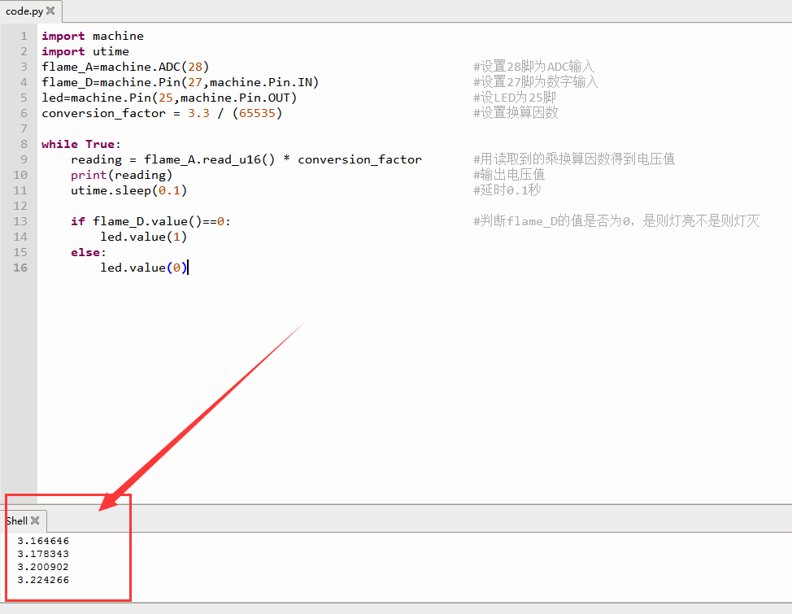

# Python


## 1. Python简介  

Python是一种高级编程语言，以其简单易读的语法和强大的功能而广受欢迎。它是一种多范式语言，支持面向对象编程、命令式编程以及函数式编程等多种编程风格。Python的广泛应用范围包括Web开发、数据分析、人工智能、科学计算以及自动化脚本等。其丰富的标准库和强大的社区支持，使得开发者能够快速构建复杂的应用，极大地提高了开发效率。由于其卓越的可读性和简洁性，Python也被广泛用于教育领域，帮助初学者掌握编程的基本概念和思维方式。在物联网（IoT）应用中，Python也凭借轻量级版本如MicroPython，能够高效地运行在微控制器上，适合嵌入式系统开发。  

## 2. 连接图  

  

## 3. 测试代码  

```python  
import machine  
import utime  

flame_A = machine.ADC(28)  # 设置28脚为ADC输入  
flame_D = machine.Pin(27, machine.Pin.IN)  # 设置27脚为数字输入  
led = machine.Pin(25, machine.Pin.OUT)  # 设LED为25脚  
conversion_factor = 3.3 / (65535)  # 设置换算因数  

while True:  
    reading = flame_A.read_u16() * conversion_factor  # 用读取到的值乘换算因数得到电压值  
    print(reading)  # 输出电压值  
    utime.sleep(0.1)  # 延时0.1秒  

    if flame_D.value() == 0:  # 判断flame_D的值是否为0，是则灯亮，不是则灯灭  
        led.value(1)  
    else:  
        led.value(0)  
```  

## 4. 测试结果  

按照上图接好线，烧录好代码；上电后，打开串口监视器并设置波特率为9600可看到从火焰传感器读取到的模拟值。调节模块电位器，使模块上D1处于亮起和关闭的临界点，D1关闭。传感器没有检测到火焰时，传感器上的D1灯关闭，板上的D13指示灯也关闭；当传感器检测到火焰时，传感器上的D1灯亮起，板上的D13指示灯亮起。  




